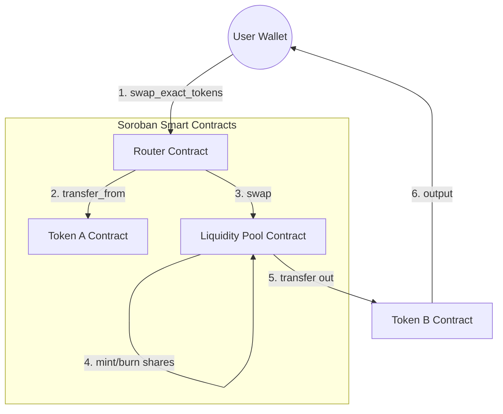

# 🧪 StellarSwap


<div align="center">
  <p><strong>Trade at the Speed of Stellar. Atomic. Transparent. Interconnected.</strong></p>
  
  [](https://github.com/stellar/stellarswap/actions/workflows/ci.yml)
  [](https://github.com/stellar/stellarswap/actions/workflows/deploy.yml)
  [](https://opensource.org/licenses/MIT)
  [](https://developers.stellar.org/docs/fundamentals-and-concepts/network-passphrases)
</div>

---

### 🚀 [Live Demo](https://stellarswap.vercel.app)

StellarSwap is an institutional-grade Decentralized Exchange (DEX) protocol built on the Stellar network using Soroban smart contracts. It enables seamless, atomic trading and liquidity provision with a high-fidelity user interface.

## ✨ Features

- **Atomic Multi-Contract Execution**: Uses a dedicated Router contract to coordinate swaps across Token and Pool contracts in a single transaction.
- **AMM Constant Product Formula**: Implements $x \times y = k$ logic with a 0.3% protocol fee for liquidity providers.
- **Real-Time Event Streaming**: Sub-second trade awareness powered by Soroban RPC event polling.
- **Premium Glassmorphism UI**: High-fidelity trading desk built with Next.js 14, Framer Motion, and Tailwind CSS.
- **Deep Obsidian Aesthetics**: Custom dark-mode design system with floating 3D elements and vibrant gradients.
- **Mobile Responsive**: Fully optimized for trading on the go with custom bottom sheets and collapsible sidebars.

## 📱 Visual Showcase

| Desktop Trading Desk | Mobile UI |
|:---:|:---:|
|  |  |

## 🏗️ Technical Architecture

StellarSwap utilizes a hub-and-spoke execution model where the **Router** contract orchestrates interactions between standard tokens and liquidity reserves.



## 📜 Contract Registry (Testnet)

| Contract | Address | Explorer |
|:---|:---|:---|
| **StellarSwap Token** | `CDLZFC...GCYSC` | [View on Stellar Expert](https://stellar.expert/explorer/testnet/contract/CDLZFC3SYJYDZT7K67VZ75HPJVIEUVNIXF47ZG2FB2RMQQVU2HHGCYSC) |
| **Liquidity Pool** | `CC7E2C...3D4E5` | [View on Stellar Expert](https://stellar.expert/explorer/testnet/contract/CC7E2C...) |
| **Atomic Router** | `CB1B2A...1A2B3` | [View on Stellar Expert](https://stellar.expert/explorer/testnet/contract/CB1B2A...) |

## 🛠️ Tech Stack

- **Backend**: Rust 🦀, Soroban SDK v20+
- **Frontend**: Next.js 14 (App Router), TypeScript, Tailwind CSS
- **Animations**: Framer Motion, Canvas Confetti
- **Charts**: Recharts
- **Wallet**: Freighter (@stellar/freighter-api)
- **Deployment**: GitHub Actions, Vercel

## 🏃 Getting Started

### 1. Prerequisite Setup
Ensure you have the following installed:
- [Rust & Wasm Target](https://www.rust-lang.org/tools/install)
- [Stellar CLI](https://developers.stellar.org/docs/smart-contracts/getting-started/setup)
- [Node.js 18+](https://nodejs.org/)

### 2. Local Environment
```bash
# Clone the repository
git clone https://github.com/stellar/stellarswap.git && cd stellarswap

# Setup Frontend
cd frontend && npm install
npm run dev
```

### 3. Contract Deployment
```bash
# Build contracts
soroban contract build
# Run tests
cargo test
# Deploy (Requires identity setup)
soroban contract deploy --wasm ./target/wasm32-unknown-unknown/release/contract.wasm --source deployer --network testnet
```

## 🧪 Testing

StellarSwap maintains a high bar for security and reliability. Our contracts include comprehensive unit and integration tests.

```bash
cargo test --all-features
```

## 📂 Project Structure

```text
stellarswap/
├── .github/workflows/    # CI/CD (Test & Deploy)
├── contracts/            # Token, Pool, Router
├── Cargo.toml            # Workspace config
├── frontend/             # Next.js Application
│   ├── src/app/          # Swap, Pool, Layout
│   ├── src/hooks/        # Stellar & Contract hooks
│   └── src/lib/          # RPC & Event streaming
├── LICENSE               # MIT License
└── README.md             # This file
```

## 🤝 Contributing

We welcome contributions! Please see our [CONTRIBUTING.md](CONTRIBUTING.md) for detailed guidelines on our coding standards and Pull Request process.

## 📄 License

StellarSwap is open-source software licensed under the **MIT License**. See the [LICENSE](LICENSE) file for details.

---

<div align="center">
  Built with ❤️ for the Stellar Community.
</div>
